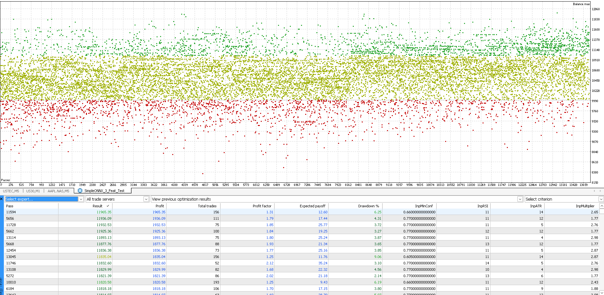
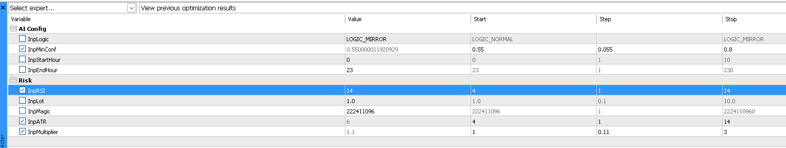
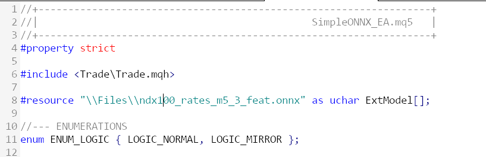
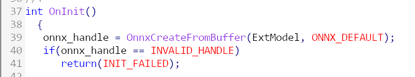

# Mql_Neural: A set of MQL5 EAs and Python scripts that use ONNX models to predict the market

## Features

- MQL5 EAs for MetaTrader 5
- Python scripts for model training and evaluation
- ONNX models for neural network inference

## Screenshots

- SimpleONNX_3_Feat_Test results in NASDAQ100 M5

- SimpleONNX_3_Feat_Test parameters used for backtest

## How to backtest the EA using an inference model

- Compile ONNX as resource inside the executable

- Load the ONNX from resource buffer

